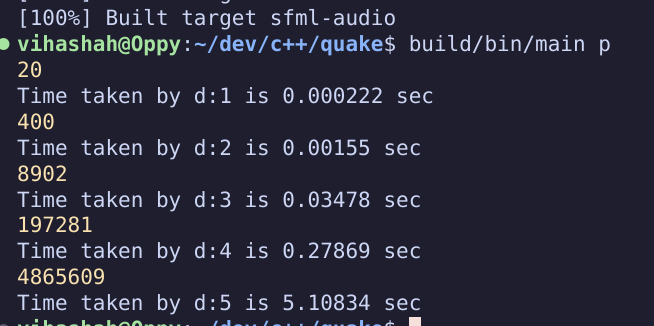

## Thoughts on decision making
- my goal is to make a very very simple albeit inefficient engine. I don't think i'll make all the correct decisions the first time around anyways. 
- Currently i plan to use the 8 by 8 board representation to make it extremely simple for me to think, later it can be moved to more efficient bitboard implementations. 
- move generation will be done using the mailbox method (because that seems simplest):  
- represent this as a 1 d array instead of 2d array 
- i am doing a square centric representation of the board. 
## Move generator must:
- take a chess position as input and return the list of all the legal moves as output. 
  - first generate all psuedo legal moves
  - then check if move is legal

## Use this later: 
- https://www.chessprogramming.net/category/perft/

## Optimizations Progress and techniques:
- No optimizations whatsoever(current): 
  
- Passed in only references to move in unmake and make (slowed it down??)

- Only passing in Const references for Move and references for board. 
- With shared pointers instead of raw pointers: 

### Notes from a reditter (@javasucks55):
- Well i made mine in c++ so it might not be the same for you, depending on your language. Here are some of the optimizations that helped the most. My current engine runs at 240 million nodes a second with correct score (tested up to depth 8).

- One of my biggest improvements came from pre allocating all my memory, so don’t use dynamic memory like vectors. I made an array of size 1024 which holds a counter. Each recursive iteration, keep track of how many moves on the “stack” needs to be popped in that call. Then decrease the counter for each move that is finished (at return of each call).

- Use pre-defined bitboards for knights, kings, and magic bitboards for bishops and rooks, queens are just a combination of rooks and queens. Magic bitboards are quite difficult to get right, especially at compile time, it took me about 3 days to get it right but it’s worth it.

- Avoid allocating / copying memory when possible in functions reuse allocated memory as much as possible.

- Don’t use for loops to check each square, use while loops with native compiler features like popcount. Run the while loop while popcount > 0, pop the next bit of the bitboard at the end of the iteration.

- Avoid if statements as if each one will cost you $100. For example, if you want to get the piece at position n, don’t test each bitboard using if statements, i implemented it like this:

- bitmask = 1 bit at position to check For(int i in bitboards) piece += !(bitboards[i] & bitmask) && i == piece; Return piece. This goes through all boards but stops incrementing piece as soon as a 1 bit is found. This was faster than if… else if… etc. Even though we can’t stop prematurely.

- Instead of doing a move, checking if king is attacked, undo move, make a check board that keeps track of all attacked squares. Then you can save a lot of computations by simply checking if the piece you’re moving does not intersect with the check board mask. Only works if moving piece is not a king.

- Bulk counting moves (not evaluating the leave nodes).

- Make small functions inline.

- Make an array of move square generators (function pointers). This way you can get the move squares using: movegeneratorspiece instead of using switch or if statements.

- Zobrist hashing, these are quite difficult to get right for perft test, since here we care a lot about collisions. I fixed this by only hashing and checking at depth 2 up to depth 5. This way you store little hashes but it sped things up for about 40%.

- MOST IMPORTANT: Use a profiler (i use vtune which was extremely easy and intuitive to use, didn’t even need a tutorial). Check which functions take up most cpu time, check from where they are called and think about ways to call them less often or improve their efficiency.

- My initial version ran at less than 100k per second, these were pretty much the biggest improvements, allowing me to get to 240 million per second.

- If you’d like more details or would like me to send you some of the code let me know. It’s still in early stage but i’d be happy to share what i have so far.

- Edit: i’m always happy to help, if anyone else has questions feel free to message me any time.

